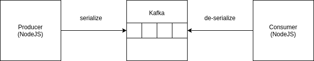
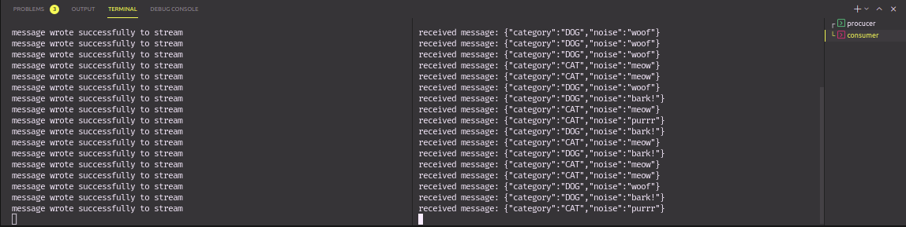

# Sobre o projeto
Meu primeiro projeto utilizando Kafka. O objetivo foi a criação de um topico que será alimentado por um producer randômico. O consumer receberá a menssagem e a exebirá no console.
Criado seguindo a aula [Node.js Producer & Consumer](https://www.youtube.com/watch?v=EiDLKECLcZw) créditos ao [Kris Foster](https://github.com/kriscfoster)
<br />

# Como rodar


1 - Instale as dependências
```bash
yarn
```
2 - Suba os containers
```bash
docker-compose up
```
3 - Crie o topic
```bash
docker exec -it kafka /opt/bitnami/kafka/bin/kafka-topics.sh --create --zookeeper zookeeper:2181 --replication-factor 1 --partitions 1 --topic test
```
4 - Execute o producer
```bash
yarn start:producer
```
```
4 - Execute o consumer
```bash
yarn start:consumer
```

# Construído utilizando
* [docker](https://www.docker.com/)
* [kafka](https://kafka.apache.org/)
* [node-rdkafka](https://www.npmjs.com/package/node-rdkafka)
* [avsc](https://www.npmjs.com/package/avsc)

---
Criado com 🖤 por [Vinicius Mazon](https://www.github.com/viniciusmazon)